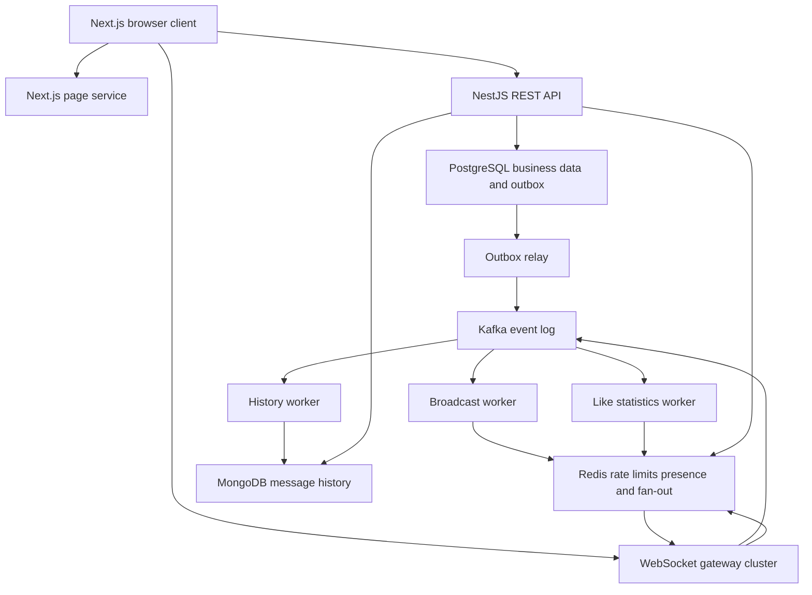

# LivePulse Technology Stack and System Architecture

Version: 1.0  
Date: October 8, 2026  
Related requirements: LivePulse Live Interaction and Danmaku Platform Requirements 1.0

## 1 Technology Choices and Overall Design

The project uses a TypeScript monorepo with a Next.js frontend and Node.js/NestJS backend. RESTful APIs handle rooms, identity, history, likes, and administration. WebSocket handles low-latency bidirectional interaction. PostgreSQL stores transactional business data, MongoDB stores message history, Redis stores ephemeral state and distributes room events, and Kafka provides a durable event log for asynchronous processing.

The web, API, gateway, and worker processes deploy independently. The design does not require every business module to become its own microservice. Node.js is the runtime, TypeScript is the language, and NestJS is the backend framework. Next.js Route Handlers do not serve as the primary business backend or the long-lived WebSocket gateway.

The working project name is LivePulse and may be changed before repository creation. The database choice is PostgreSQL plus MongoDB. DynamoDB is not added at the same time because it would duplicate storage responsibilities and create another consistency path. Docker, Kubernetes, AWS EC2, and CI/CD are introduced in phases.

## 2 Technology Stack

| Layer | Choice | Responsibility |
| --- | --- | --- |
| Language | TypeScript with strict mode | Frontend and backend types plus shared contracts |
| Runtime | A supported Node.js LTS release | APIs, long-lived connections, and workers; verify and pin the exact version when the repository is created |
| Frontend | Next.js App Router and React | Routing, pages, server-side data access, and client interaction |
| UI | Tailwind CSS and shadcn/ui | Responsive layouts and accessible components |
| REST state | TanStack Query | Cache, pagination, request state, and invalidation |
| WebSocket state | Dedicated React hook with a bounded in-memory buffer | Connection lifecycle, reconnection, and message deduplication; WebSocket events are not modeled as REST queries |
| Backend | NestJS with the Fastify adapter | Modular REST APIs, authorization, and dependency injection |
| WebSocket | ws wrapped in a dedicated NestJS gateway | Native WebSocket protocol without a Socket.IO-specific event protocol |
| SQL | PostgreSQL and Prisma | Users, rooms, permissions, likes, sessions, and the outbox |
| Document database | Official MongoDB Node.js driver | Message history, idempotent upserts, batch writes, and TTL |
| Cache and fan-out | Redis and node-redis | Rate limiting, presence, read models, and Pub/Sub |
| Event bus | Apache Kafka and KafkaJS | Message ingestion, fan-out and history consumers, and replayable logs |
| Input contracts | Zod and a shared contracts package | REST request and WebSocket envelope validation; backend-generated OpenAPI |
| Engineering tools | pnpm workspace, ESLint, and Prettier | Workspace management, lockfile, and quality checks |
| Automated tests | Vitest, HTTP integration tests, and Playwright | Business unit tests, integration tests with real dependencies, and browser end-to-end tests |
| Load testing | k6 REST scenarios and a dedicated WebSocket load tool | Connection, fan-out, latency, duplicate, and loss measurements |
| Observability | Pino, prom-client, Prometheus, and Grafana | Structured logs, metrics, and dashboards |
| Containers | Docker and Docker Compose | Local multi-component environment and the first EC2 demo |
| Orchestration | Kubernetes, kind locally, and k3s on EC2 | Later application deployment, rolling updates, and autoscaling experiments |
| CI/CD | GitHub Actions and AWS ECR | Checks, tests, image builds, releases, and rollback |
| Cloud | AWS EC2, EBS, IAM, DNS, and TLS ingress | Containers, persistent volumes, least-privilege access, and the public endpoint |

During setup, verify compatibility among the framework, adapters, drivers, and Node.js. Pin exact versions in package.json, the lockfile, and container image tags. Floating latest tags are not used for reproducible releases.

## 3 System Structure



The web service renders pages, the API exposes REST resources, the gateway manages connections and local room membership, and worker roles run from the same codebase. Each gateway keeps only its local connection objects. WebSocket objects are not centralized in Redis.

## 4 Why the Platform Uses Both REST and WebSocket

A RESTful API is a resource-oriented interface style, not a low-latency broadcast protocol. Normal HTTP fits identity, room CRUD, likes, and paginated history. WebSocket fits chat, danmaku, and room-statistics push. Both use the same identity and authorization rules.

| Method and Path | Purpose | Key Response |
| --- | --- | --- |
| POST /api/v1/auth/register | Register | 201 or email conflict |
| POST /api/v1/auth/login | Sign in and set cookies | 200 or 401 |
| POST /api/v1/auth/refresh | Rotate the refresh session | 200 or 401 |
| POST /api/v1/auth/logout | Revoke the session | 204 |
| GET /api/v1/rooms | Cursor-paginated room list | 200, items, and nextCursor |
| POST /api/v1/rooms | Create a room as a host | 201 |
| GET /api/v1/rooms/:id | Get room details | 200 or 404 |
| PATCH /api/v1/rooms/:id | Edit metadata or perform a legal state transition | 200, 403, or 409 |
| GET /api/v1/rooms/:id/messages | Paginate history or synchronize after a cursor | 200 |
| PUT /api/v1/rooms/:id/likes/me | Set the current user's like | 200 with the same result on repetition |
| DELETE /api/v1/rooms/:id/likes/me | Remove the current user's like | 204 |
| POST /api/v1/rooms/:id/mutes | Mute a room user as the host | 201 or 403 |
| DELETE /api/v1/rooms/:id/messages/:messageId | Moderation deletion | 204 or 403 |
| POST /api/v1/reports | Report content | 201 |
| GET /health/live and /health/ready | Process liveness and traffic readiness | 200 or 503 |
| GET /metrics | Internal metrics scraping | Prometheus text format |

Every request and error includes requestId. The error structure contains code, message, requestId, and an optional retryAfterMs. GET requests have no write side effects. WebSocket failures use the same error-code catalog.

## 5 WebSocket Contract

The connection path is /ws and uses wss in public environments. The web, API, and WebSocket endpoint should share one site behind a reverse proxy. The handshake validates a short-lived identity cookie and an allowed Origin. Cookies use HttpOnly, Secure, and an appropriate SameSite setting. REST write operations also require a CSRF token. Guests may join public rooms but cannot send messages.

Example shared envelope:

```json
{
  "v": 1,
  "type": "message.send",
  "requestId": "req_example",
  "payload": {
    "roomId": "room_example",
    "clientMessageId": "client_uuid",
    "text": "Hello everyone"
  }
}
```

| Direction | Event | Description |
| --- | --- | --- |
| Client to gateway | room.join, room.leave | Validate access and create or remove local room membership |
| Client to gateway | message.send | Validate, rate-limit, generate a stable messageId, and append to Kafka |
| Gateway to client | room.joined | Current room, statistics snapshot, and subscription-ready marker |
| Gateway to client | message.accepted | Broker acknowledgement, messageId, and clientMessageId |
| Gateway to client | message.created | messageId, roomId, authorId, text, acceptedAt, and position |
| Gateway to client | message.deleted | Tombstone and messageId |
| Gateway to client | room.stats, room.ended | Statistics update or room termination |
| Gateway to client | error | Failure associated with a requestId |

The server derives messageId deterministically from userId, roomId, and clientMessageId under a fixed namespace. A client cannot claim another user's identity. Kafka retries may produce two log records, while history deduplicates by messageId. An ACK timeout is an unknown outcome. The client retries with the same ID rather than generating a new one.

The same ID cannot carry different text. A retry must reuse the original payload. The server persists a payloadHash and detects conflicts; a conflicting event enters quarantine and never overwrites existing history. Atomic receiver-side deduplication may be added later. The first version guarantees idempotent storage and display but does not claim a completely duplicate-free Kafka log.

## 6 Message Path and Cross-Node Fan-Out

### 6.1 Recommended Path

Gateway → Kafka chat.messages.v1 → Broadcast Worker → Redis room channel → every gateway subscribed to the room → local connections on each gateway.

An independent History Worker consumes the same Kafka topic and writes to MongoDB. The gateway returns accepted after Kafka acknowledges the append. Fan-out and persistence operate independently, so a MongoDB outage does not immediately block Kafka ingestion until storage or lag reaches a protection threshold.

### 6.2 Kafka Consumer Groups

- broadcast-v1 distributes room events to Redis.
- history-v1 persists message history.
- likes-stats-v1 processes a like-change topic and updates the count cache.

One partition is processed by one consumer within a consumer group. Placing all gateways in the same consumer group would not deliver every message to every gateway; users connected to other gateways would miss events. The first version therefore uses Redis Pub/Sub to deliver each room event to all interested gateways.

A gateway subscribes to a room channel only while it has local connections in that room. The first user waits until the subscription is active before receiving room.joined. After the last user leaves, the gateway delays unsubscription to prevent rapid subscribe/unsubscribe churn.

### 6.3 Reliability Boundary

Redis Pub/Sub has no durable replay, so an offline subscriber misses the event. It provides the low-latency online path; Kafka and MongoDB provide recovery data. The Broadcast Worker commits its offset after Redis publish succeeds. A crash after publish but before commit may broadcast the same event twice. A successful publish response also does not prove that a browser received the message.

During reconnection, the client establishes its subscription and buffers live events before querying history. It merges both streams using stable IDs. When history persistence is delayed, the client performs a limited retry. It retains tombstones so that an older event cannot restore deleted text. The first version has no durable per-user delivery receipt. Adding reliable chat would require explicit delivery state, client ACKs, replay, and additional storage.

### 6.4 Ordering and Hotspots

Kafka uses roomId as the message key, so one room maps to one partition under a fixed partition count. A position consists of topic, partition, and offset, with offset serialized as a string. The Broadcast Worker publishes records serially within a partition. History retains the corresponding position, and a duplicate ID retains the position of its first persisted record.

Partitions must not be added casually to the chat topic because key remapping can break room order across the migration. A migration requires a new topic or an explicit routing epoch. A very large room becomes a single-partition and broadcast hotspot; merely adding workers does not remove it. A later design may shard fan-out through hierarchical room gateways, but that requires new ordering and recovery contracts.

## 7 Data Ownership and Models

### 7.1 PostgreSQL Transactional Data

| Table | Main Fields and Constraints |
| --- | --- |
| users | id, unique email, password_hash, role, created_at |
| refresh_sessions | id, user_id, token_hash, expires_at, revoked_at |
| rooms | id, host_id, title, description, status, video_url, version, timestamps |
| room_likes | composite primary key of room_id and user_id, created_at |
| room_mutes | room_id, user_id, muted_by, expires_at, composite unique constraint |
| reports | id, reporter_id, room_id, message_id, reason, status |
| audit_logs | id, actor_id, action, target_id, created_at |
| outbox_events | unique event_id, aggregate_id, payload, created_at, published_at, attempts |

PostgreSQL owns facts that require transactions and uniqueness. It does not store every chat message. A like mutation and its outbox event are written in one transaction. The outbox relay marks the event as published after Kafka accepts it and retries failures, so downstream consumers must still be idempotent.

The like cache does not use an unguarded INCR. In the first version, the statistics worker receives a change event, queries the current SQL COUNT, and refreshes Redis. Concurrent refreshes require per-room serialization and version protection. At larger scale, this can become a deduplicated incremental read model with reconciliation. The first path demonstrates correctness and does not claim unlimited like throughput.

### 7.2 MongoDB Message History

The messages collection contains _id=messageId, roomId, userId, clientMessageId, text, payloadHash, acceptedAt, partition, offset, deletedAt, and expiresAt. The server stores offset in a sortable 64-bit type and serializes it as a string in APIs.

Indexes include the unique _id, a compound roomId/partition/offset pagination index, and a single-field expiresAt TTL index. TTL deletion runs asynchronously in the background and does not guarantee deletion at the exact expiry time, so reads also filter expiresAt.

Batch consumers use bulkWrite with $setOnInsert upserts. The initial batch size is 200 with a configurable maximum wait of 100 ms. Deletion writes a tombstone, and replayed events cannot overwrite the deleted state. A worker commits offsets only after successful persistence. It does not commit past a failed record, and reprocessing already written records must remain safe.

Permanent schema failures are written to chat.messages.dlq.v1 and trigger an alert. The consumer advances the corresponding offset only after the DLQ append is acknowledged. A database outage is transient and is not immediately treated as a poison message. Tests that claim “all messages persisted” exclude or separately count quarantined records.

### 7.3 Redis Ephemeral and Derived State

| Key or Channel | Purpose | Recovery |
| --- | --- | --- |
| room:{id}:presence | ZSET whose member is connectionId and score is the expiry time | Rebuilt by heartbeats; expired members are removed |
| conn:{connectionId} | User-to-gateway mapping with TTL | Recreated on reconnection |
| room:{id}:stats | Connection count, unique-user count, and update time | Rebuilt from presence and the SQL like count |
| rate:{userId}:{roomId} | Atomic token bucket | Expires; degrades when Redis is unavailable |
| room:{id}:meta | Short-lived room-state cache | Reloaded from PostgreSQL |
| room:{id}:mute:{userId} | Short-lived mute cache | Reloaded from PostgreSQL |
| room:{id}:events channel | Pub/Sub room events | No replay; recovered through history synchronization |

Presence uses one lease per connection. The unique-user count deduplicates active connection mappings and is initially recomputed every five seconds. Large rooms require sharded aggregation or a more efficient reference-and-expiry index, with measured Redis cost. A clean gateway shutdown removes its connections, while a crash relies on lease expiry. Presence cannot be modeled only as increment-on-connect and decrement-on-disconnect counters.

Redis is never the sole source of truth for users, rooms, likes, or chat history. A production multi-tenant Redis Cluster would require explicit key-slot and atomic-script compatibility design. The first version uses one Redis instance.

## 8 Kafka Configuration and Asynchronous Processing

The chat topic initially uses six partitions and 24-hour retention. Persistence and fan-out use separate consumer groups. A one-broker demo uses replication factor 1. A high-availability experiment requires at least three brokers, replication factor 3, min.insync.replicas=2, and producer acks=all. On a single broker, acks=all does not provide multi-replica durability.

The producer enables the idempotence settings supported by the selected client and verifies its failure and retry behavior. Application retries still depend on a stable messageId. Consumers commit only contiguous offsets through the last successfully completed record and never commit beyond an unprocessed failure.

Partition count limits parallelism within a consumer group, so adding consumers does not always improve throughput. Monitor consumer lag, age of the oldest unprocessed event, broker disk usage, and the retention window. Near a capacity threshold, the platform limits or stops ingestion; the presence of a queue does not make buffering infinite.

## 9 Node.js Concurrency and Browser Performance

The Node.js event loop suits I/O-heavy concurrency, while each process still has CPU, memory, and file-descriptor limits. Avoid synchronous file operations, repeated per-connection JSON serialization, and one enormous fan-out loop. Serialize an event once, send in batches, and periodically yield to the event loop. CPU-heavy work can move to a separate worker process or worker_threads.

The gateway initially caps each connection's send buffer at 256 KiB and disconnects a client that remains above the threshold for approximately five seconds. Load tests determine the final values. Statistics keep only the newest value. When a normal message cannot be sent, record a missed delivery and let the client recover through history rather than buffering without limit.

The approximate downstream delivery count is the sum, across rooms, of room message rate multiplied by receiving connections in that room. For example, 100 messages per second in a room with 1,000 receiving connections produces approximately 100,000 downstream delivery attempts per second. A 200-byte payload alone is about 20 MB/s before WebSocket, TCP, TLS, and proxy overhead. This is not the same as 100,000 new user messages per second.

The frontend controls network intake and UI rendering separately through a bounded deduplication cache, finite history list, virtualized rows, requestAnimationFrame batching, and a cap on simultaneous danmaku items. Hidden tabs reduce render frequency so that high traffic does not exhaust browser memory.

## 10 Docker Kubernetes and AWS Deployment

### 10.1 Local Environment

Docker Compose runs web, API, gateway, broadcast-worker, history-worker, outbox-relay, stats-worker, PostgreSQL, MongoDB, Redis, Kafka, Prometheus, and Grafana. During development, applications may run on the host while only dependencies use containers, avoiding a rebuild of every service for each code change.

Docker images use multi-stage builds and a non-root user. Next.js uses standalone output. Persistent services mount separate volumes. The repository provides .env.example but never commits a real .env file.

### 10.2 Initial EC2 Release

The first cloud release uses one EC2 instance and Docker Compose. A TLS reverse proxy routes /, /api, and /ws. Applications and data services run on a private container network, and persistent data resides on EBS. A starting point of 4 vCPU and 16 GiB of memory may be tested, but it does not imply that performance targets will be met. The resource cost of co-locating Kafka and the databases must be measured.

The security group exposes only HTTPS and required ingress. Administration uses AWS Systems Manager, while databases and Kafka remain private. Configure log rotation, disk alarms, scheduled database backups, and restore drills. EC2 compute, EBS, network transfer, and image storage have separate charges, so current pricing must be checked before deployment. This document does not state an unverified monthly cost.

### 10.3 Later Kubernetes Phase

Validate manifests locally with kind and then use k3s on EC2. Multiple Pods on one EC2 host do not provide multi-machine high availability. Applications use Deployments, Services, ConfigMaps, Secrets, resource requests and limits, and readiness/liveness probes. Demo data services may use StatefulSets and persistent volume claims, but they still require independent backups.

At repository-creation time, select a maintained ingress proxy or Gateway implementation with WebSocket support and verify upgrade handling, idle timeouts, and TLS. During a release, first remove readiness, stop accepting new connections, notify clients to reconnect, and clean up old connections and presence within terminationGracePeriod. Before a worker exits, it finishes the current batch and commits offsets safely.

The first HPA experiment uses CPU. Later experiments add gateway connection count, event-loop delay, and consumer lag as custom metrics. These require Metrics Server or a metrics adapter; installing Prometheus alone does not automatically expose metrics to HPA. Scale-out accepts new connections but does not migrate existing WebSocket connections to new Pods. Scale-in and consumer rebalancing each require dedicated validation.

## 11 CI/CD Pipeline

Pull request pipeline: install locked dependencies → lint → typecheck → unit tests → integration tests with temporary real dependencies → core Playwright flows → build validation.

Main-branch pipeline: build images tagged with the commit SHA → scan → obtain short-lived AWS permissions through GitHub Actions OIDC → push to ECR → deploy the test environment → run smoke tests → deploy the demo environment. Protected environments may require manual approval, although every change does not need an approval step.

Database migrations run independently and use an expand-and-contract sequence to keep old and new application versions compatible. Application rollback selects the previous image. An image rollback does not automatically reverse a destructive database migration. Kubernetes releases verify rollout and end-to-end health. Compose releases use versioned configuration and retain a recoverable previous image.

## 12 Testing and Observability

| Type | Focus |
| --- | --- |
| Unit | State machine, permissions, message schemas, stable IDs, conflict detection, and rate-limit boundaries |
| Integration | SQL like uniqueness and outbox, MongoDB idempotent batch writes, Kafka offsets, and Redis cross-gateway fan-out |
| End to end | Login, join, send, like, end room, mute, delete, and reconnect |
| Failure | Kill gateway after acceptance, crash after DB write before commit, interrupt Redis, and stop/recover MongoDB |
| Load | Idle connections, steady fan-out, hot room, short burst, slow clients, and consumer recovery |

Metrics include at least active_connections, unique_users, accepted_messages_total, ws_delivery_attempts_total, ws_dropped_total, ack_latency, sampled_delivery_latency, event_loop_delay, consumer_lag, persistence_latency, dlq_total, rate_limited_total, and buffered bytes.

roomId, userId, and messageId are not used as unbounded high-cardinality Prometheus labels. Structured logs locate a specific message. Fan-out tests use receiver-observed sequence numbers or IDs to calculate expected deliveries, actual unique deliveries, duplicates, and missed deliveries. The number of server send calls does not prove how many messages browsers received.

## 13 Suggested Repository Structure

| Path | Content |
| --- | --- |
| apps/web | Next.js pages and client components |
| apps/api | NestJS REST resources and authorization |
| apps/gateway | WebSocket lifecycle, room connections, and inbound handling |
| apps/worker | Role-based broadcast, persistence, statistics, and outbox relay processes |
| packages/contracts | Zod schemas, event types, and shared error codes |
| packages/config | Environment-variable and configuration validation |
| packages/db | Prisma schema, migrations, and SQL client |
| packages/observability | Logging and metrics wrappers |
| infra/compose | Local and EC2 Compose configurations |
| infra/k8s | Application and experiment manifests |
| tests/integration and tests/e2e | Cross-component and browser acceptance tests |
| benchmarks | Load-test scripts, parameters, and results |
| docs | Requirements, architecture, deployment, failure, and load-test reports |
| .github/workflows | CI and deployment workflows |

## 14 Major Tradeoffs and Extension Boundaries

The design prioritizes a demonstrable business flow and a verifiable distributed path. MongoDB owns append-oriented message history, SQL owns transactional business data, and Redis owns temporary state. These responsibilities are distinct. Additional databases increase resource and operational cost, so each must be justified by concrete behavior.

Kafka provides durable events and decoupled consumers, while Redis provides online room fan-out. Their combination does not automatically provide reliable per-user delivery. A public application that requires durable individual messages needs separate delivery state, client acknowledgements, replay, and retention policies.

The first version uses Node.js and measures its bottlenecks. It does not promise to reproduce performance figures from a Go example. The strongest portfolio evidence will explain the capacity model, define reproducible load tests, prove safe duplicate processing, demonstrate failure recovery, and show automated deployment.

## 15 Official References

These sources verify platform behavior. The architecture, retention periods, buffer thresholds, and performance targets in this document remain project design choices rather than official performance claims.

- Apache Kafka Design: https://kafka.apache.org/41/design/design/ — partitions, consumer groups, ordering, and delivery semantics.
- Redis Pub/Sub: https://redis.io/docs/latest/develop/use-cases/pub-sub/ — online subscription delivery and the absence of durable replay.
- Next.js Self-Hosting: https://nextjs.org/docs/app/guides/self-hosting — Node.js self-hosting, reverse proxies, and multi-instance cache considerations.
- Docker Next.js Guide: https://docs.docker.com/guides/nextjs/ — containerization and standalone builds.
- Kubernetes HPA: https://kubernetes.io/docs/concepts/workloads/autoscaling/horizontal-pod-autoscale/ — scaling with resource, custom, and external metrics.
